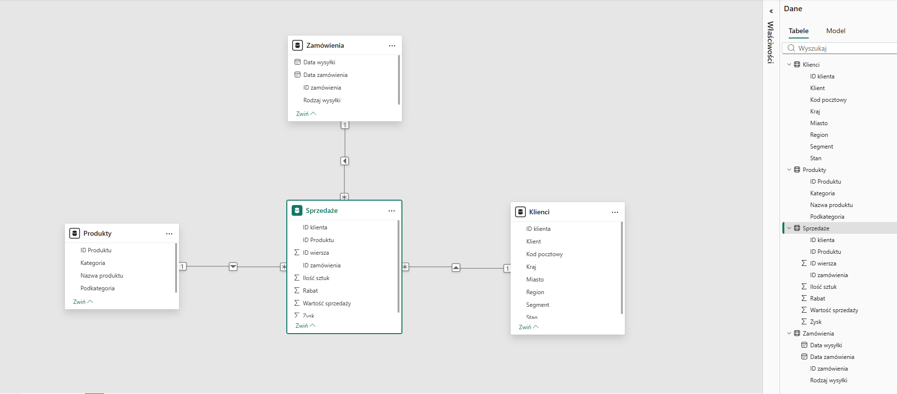
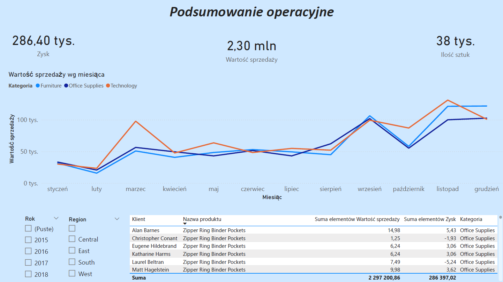
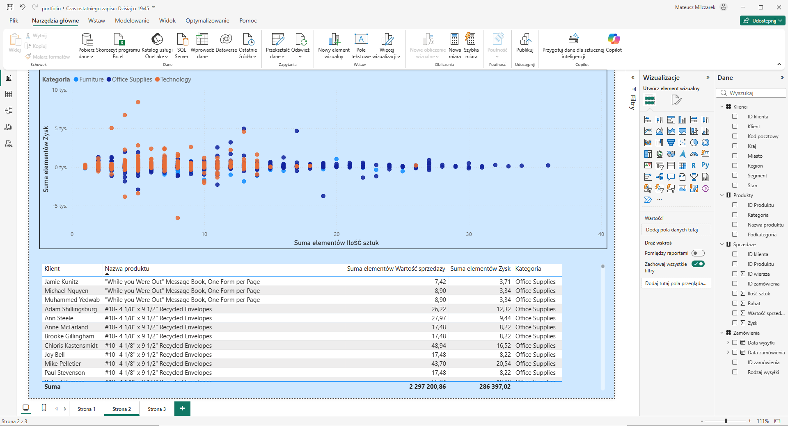
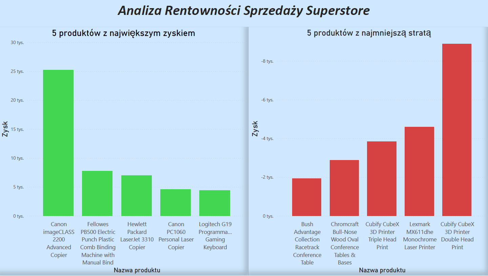

# Analiza Rentowności Sprzedaży Superstore – Power BI Case Study

## Opis projektu
Projekt polegał na przekształceniu surowych danych sprzedażowych w interaktywny dashboard analityczny. Głównym celem była identyfikacja czynników wpływających na rentowność oraz wskazanie produktów generujących straty.

## Model Danych

Zastosowałem **model gwiazdy** (Star Schema), łącząc tabelę faktów (Sprzedaż) z tabelami wymiarów (Produkty, Klienci, Zamówienia) za pomocą relacji jeden-do-wielu (1:*).

## Raport

## Kluczowe wnioski (Insights)
* **Ogólna kondycja**: Firma osiągnęła sprzedaż na poziomie **2,30 mln USD** przy zysku wynoszącym **286,40 tys. USD**.
* **Anomalie sprzedażowe**: Zidentyfikowałem, że duże skoki sprzedaży w kategorii *Technology* (np. w 2015 r.) często wynikają z jednostkowych, dużych transakcji, a nie stałego trendu wzrostowego.
* **Produkty "Gwiazdy"**: Najwyższy zysk generują urządzenia biurowe, w szczególności **Canon imageCLASS 2200 Advanced Copier**.
* **Produkty "Stratne"**: Wykryłem krytyczne straty w podkategorii drukarek 3D, gdzie model **Cubify CubeX** generuje największe ujemne marże w całym portfolio.
* **DAX**: Wykorzystałem miary DAX do liczenia sumy, średniej oraz filtrowania 5 najmniejszych/największych rekordów

## Zawartość repozytorium
* `superstore.pbix` – pełny plik projektu Power BI.
* `superstore.pdf` – kompletny raport ze wszystkimi stronami analizy.
* `img` – folder ze zdjęciami raportu i modelu
